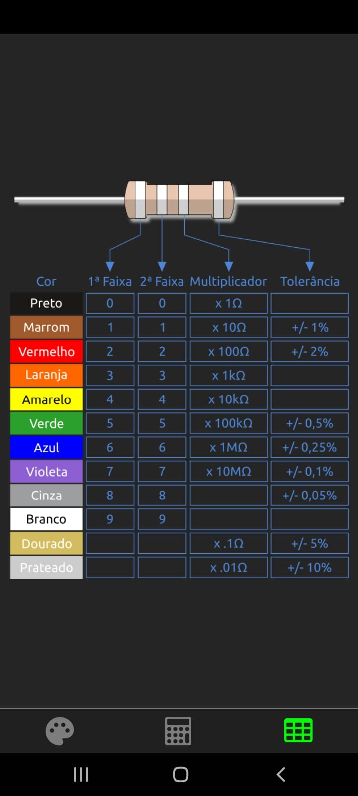

# Calculadora de Resistores

Aplicativo móvel para cálculos com resistores elétricos. Converte facilmente entre cores das faixas e valores em ohms.

Criado com foco de ajudar meus colegas de turma na matéria de IoT.

## 📱 Screenshots

<div align="center">
  
  
  
</div>

## ⚡ Funcionalidades

- Converter cores das faixas para valor em ohms
- Converter valor em ohms para cores das faixas  
- Visualizar tabela de referência cores/valores
- Navegação intuitiva por abas
- Suporte para resistores de 1Ω até 1GΩ

## 🛠️ Tecnologias

- [React Native](https://reactnative.dev/) + [Expo](https://expo.dev/)
- [TypeScript](https://www.typescriptlang.org/)
- [Styled Components](https://styled-components.com/)
- [React Navigation](https://reactnavigation.org/)
- [React Native Vector Icons](https://github.com/oblador/react-native-vector-icons)

## 📥 Instalação

```bash
# Clone o repositório
git clone https://github.com/seu-usuario/resistor-calculator-app.git

# Instale as dependências
cd resistor-calculator-app
npm install

# Execute o projeto
npm start
```

## 📱 Versões Disponíveis (APK)

- [v1.41](https://github.com/Victor-Lis/Resistor-Calculator-App/blob/master/apks/Resistor%20Calculator%20v1.27.apk) - Adição da tabela de referência 
- [v1.31](https://github.com/Victor-Lis/Resistor-Calculator-App/blob/master/apks/Resistor%20Calculator%20v1.31.apk) - Atualização dos ícones
- [v1.27](https://github.com/Victor-Lis/Resistor-Calculator-App/blob/master/apks/Resistor%20Calculator%20v1.41.apk) - Versão inicial

## 👨‍💻 Autor

[@Victor-Lis](https://github.com/Victor-Lis)

## 📄 Licença

Este projeto está sob a licença MIT. Veja o arquivo LICENSE para mais detalhes.

Código semelhante encontrado com 1 tipo de licença
