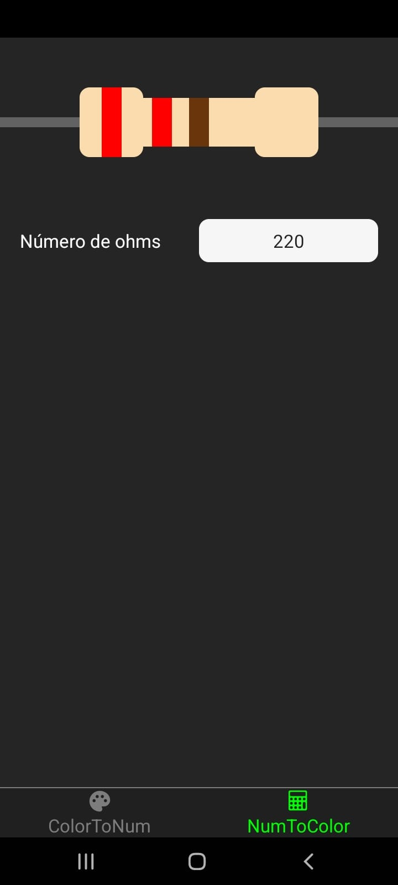

# Resistor Calculator App  

Criei esse App a partir da intenção de facilitar meus trabalhos com S.E., tanto para projetos, tanto para a matéria de S.E. no curso técnico que eu faço.
Esse App é capaz de:
- Calcular a potência do resistor atráves de suas cores;
- Através do número de ohms dar as cores do resistor respectivo.
Por conta disso, refleti mais uma vez como essa área de desenvolvimento de sistemas é de aprendizado constante e não necessáriamente sobre códigos apenas, mas também pelos conteúdos dos projetos, como nesse caso que estudei um pouco sobre eletricidade e voltagens, inclusive fiz um [post](https://github.com/Victor-Lis/Entendendo-Voltagens-Arduino) sobre aqui no GitHub.

## ScreenShots 

  
  

    
    

    

## APKS 

### v1.27 - Versão Inicial
[Baixe Aqui](https://github.com/Victor-Lis/Resistor-Calculator-App/blob/master/apks/Resistor%20Calculator%20v1.27.apk)

### v1.31 - Atualização dos icons
[Baixe Aqui](https://github.com/Victor-Lis/Resistor-Calculator-App/blob/master/apks/Resistor%20Calculator%20v1.31.apk)

## Autores
- [@Victor-Lis](https://github.com/Victor-Lis)
